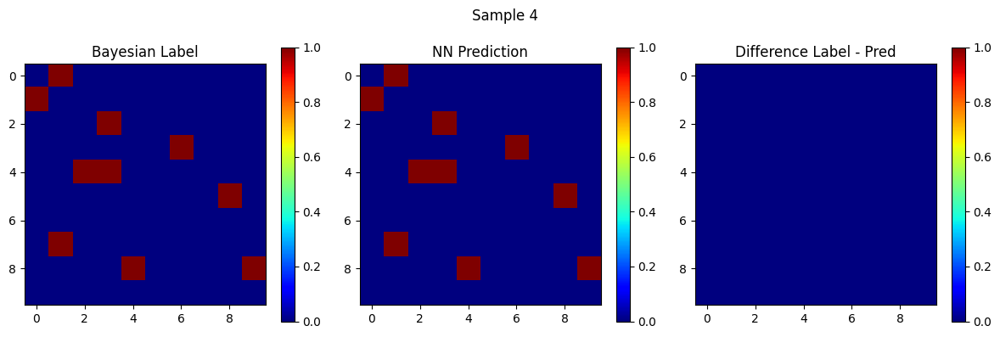
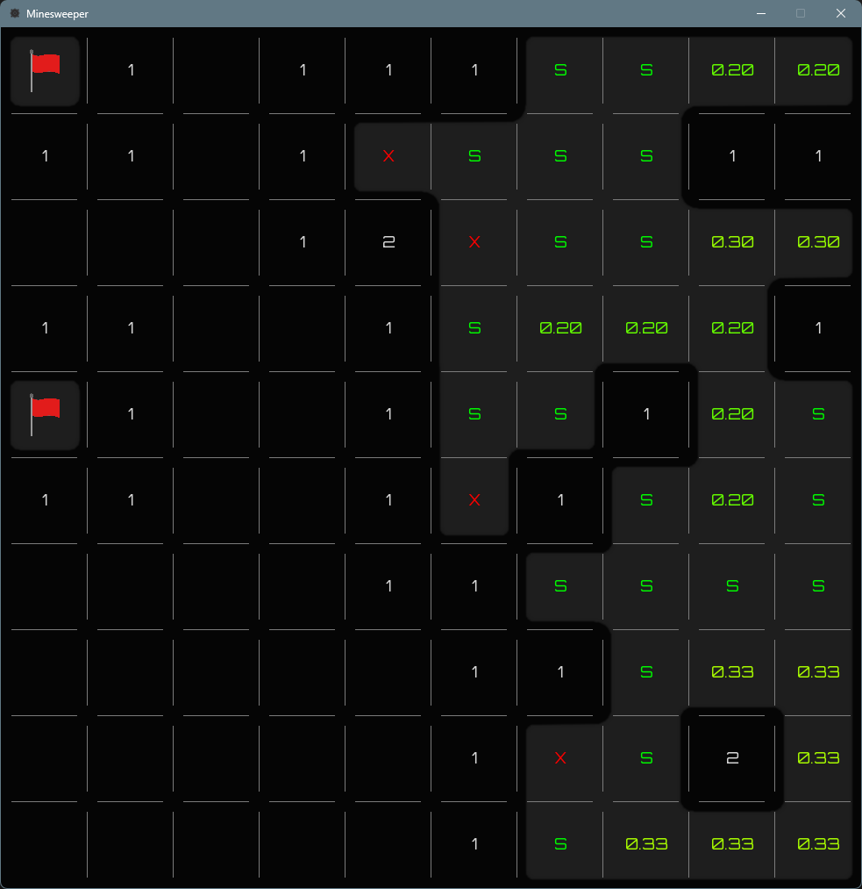

# Minesweeper Solver: ENGR 518 Course Project

This project, developed for ENGR 518, compares AI and ML approaches to solving Minesweeper. The idea came from [MrGris's](https://mrgris.com/projects/minesweepr/) awesome Bayesian solver, which calculates cell probabilities. The goal was to see if an ML model could mimic this behavior and compare its performance to the Bayesian approach.

The Bayesian solver works as a "perfect logic" benchmark, using clear rules to calculate probabilities and updating them as the game progresses. A CNN was chosen because it's great at handling spatial data. Minesweeper's grid structure has no temporal elements, so CNNs were a perfect fit.

### Key Decision: NN Model Architecture
- **Sigmoid Activation**: Used in the output layer to give probabilities (0–1) for each cell.  
- **Binary Cross-Entropy Loss**: Works great for Minesweeper because it penalizes wrong predictions, even when empty cells outnumber mined ones.

### Performance
CNNs are good at spotting patterns, but they don't handle Minesweeper's logic as well as the Bayesian solver. (I’m not an expert on CNNs by any means, so the model architecture might not be ideal for this use case, but it's not unusable either.) The solver uses clear rules to calculate probabilities, while the ML model tries to guess patterns from training data. This can cause problems when the board patterns are tricky or different from the training set, and there are a lot of possible game states, which makes it unrealistic to capture them all even for a small board. Thresholding for false negatives made the ML model perform reasonably well on large boards.

Check out the jupyter notebook for more prediction comparison.
### A Better Alternative Approach
A teammate tried using ReLU activation in a fully connected dense network to predict mine locations instead of predicting probabilities for each cell. It worked surprisingly well, even with a tiny model. ReLU's ability to ignore low-intensity features fits nicely in this regard as it could essentially switch off for cells where there are no mines.

### UI Design
The UI was inspired by [The Minesweeper Clean One](https://play.google.com/store/apps/details?id=ee.dustland.android.minesweeper&hl=en_CA). Instead of drawing individual cells, connected clusters of covered cells were merged into polygons for a smoother, blob-like look. I used Gaussian blur since Pygame has limited anti-aliasing. This also helped remove artifacts from Shapely polygon corners.
